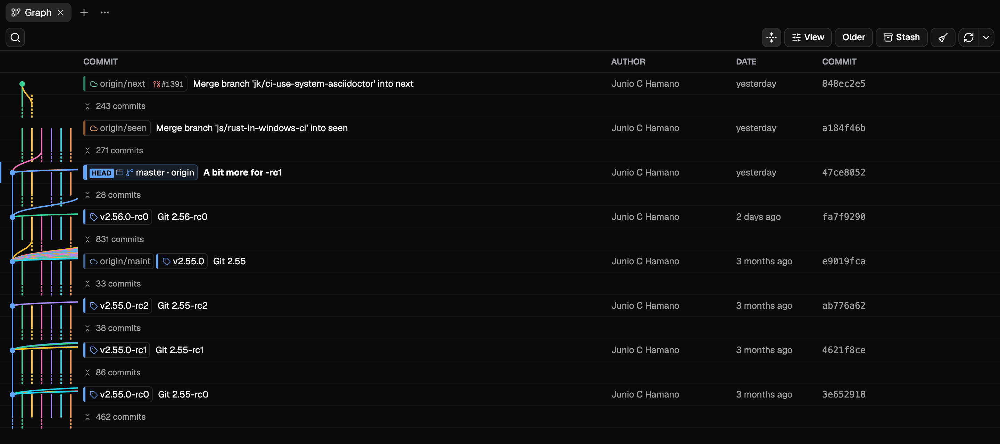

# Git Nav

Read Git history, worktrees and diffs. A desktop app for macOS, Windows and Linux.



## Install

```sh
npm install --global git-nav
git nav .
```

That installs the launcher and the binary for your platform, and puts `git nav` on your path.

Prefer an installer? Every release ships a `.dmg` for macOS, an `.exe` for Windows, and `.AppImage`,
`.deb` and `.rpm` for Linux, on both x64 and arm64:
[the latest release](https://github.com/sangonz193/git-nav/releases/latest).

The macOS build is signed and notarized, so it opens straight away. Windows is not signed yet, and
SmartScreen warns on the first launch: choose More info, then Run anyway. Once installed, the app
updates itself from signed releases.

## What it does

- A commit graph carrying branches, remote branches, tags, stashes, worktrees and pull request
  state, with a switch that folds every commit nothing points at into a run you can open in place.
- A diff between any two references, directly or from the point they forked, split or unified, with
  the files you have read marked against the patch you read them at.
- Seventeen operations, from checkout and merge to rebase, cherry-pick, revert and reset, each one
  predicting its conflicts before it runs and reporting every reference it moved.
- Branch cleanup that recognises a squash merge by content, not by ancestry, and previews what it
  would delete grouped by reason.
- Every worktree beside the repository, openable in Git Nav, an editor, a terminal or the file
  manager.

Pull request state reads through the [`gh` CLI](https://cli.github.com), so it uses the GitHub login
you already have. Without it, everything else still works.

More at [git-nav.dev](https://git-nav.dev).

## Browser access

`git-nav serve` turns on sharing in the desktop app, so you can reach your repositories from a
tablet or another machine:

```sh
git-nav serve --host 0.0.0.0
```

It prints a URL containing a token; open that once and the token is stored as a cookie. Git Nav
generates and saves a token in its application data `settings.json` the first time you run
`git-nav serve`, then reuses it. Pass `--token` to use a known value for that run, `--port` to
change the port (default 4300), or `--no-token` to disable authentication. Use `git-nav serve --stop`
to turn sharing off. `git-nav serve --foreground` runs only the HTTP server for headless machines
and browser development; because it runs without the desktop app there are no windows to track, so
worktrees never show as open.

`settings.json` also accepts `serve.host`, `serve.port`, and `serve.publicUrl`. `serve.host` accepts
`127.0.0.1` (the default) or `0.0.0.0`; `serve.port` sets the listening port; and `serve.publicUrl`
replaces the printed entry URL, for example when serving through a proxy. The proxy must serve Git
Nav at its root because path prefixes are not supported. Editing `settings.json` is currently the
only way to configure these values.

Repositories, worktrees and recently opened projects are read from the machine running the server,
and the recent list is shared with the desktop app. Branch deletion and rebasing are exposed over
the network, so leave authentication on unless the port is already protected.

Copying a commit hash needs a secure context, so it works over HTTPS or `localhost` but not over
plain HTTP to another device.

## Development

```sh
bun install
bun run dev
```

`bun run dev` and `bun run tauri dev` only serve the frontend; the HTTP API lives in
`git-nav serve --foreground`. To work on the browser build from another device, start both:

```sh
bun run dev:web
```

That runs the API server and the dev server together, so hot reloading works from a phone or
tablet. The dev server proxies `/api` to `http://127.0.0.1:4300`; set `GIT_NAV_SERVER` to point it
somewhere else.

Build the app and package the current platform binary with:

```sh
bun run build:package
```

See [the deployment guide](docs/deploy.md) for CI releases.

`apps/site` holds [git-nav.dev](https://git-nav.dev). Run it with `bun --filter=site run dev`.

UI components come from shadcn, added at the root of the `desktop` app and placed in
`packages/shadcn/src/components`:

```sh
bunx --bun shadcn@latest add button -c apps/desktop
```

```tsx
import { Button } from "@workspace/shadcn/components/button"
```

## License

[MIT](LICENSE)
